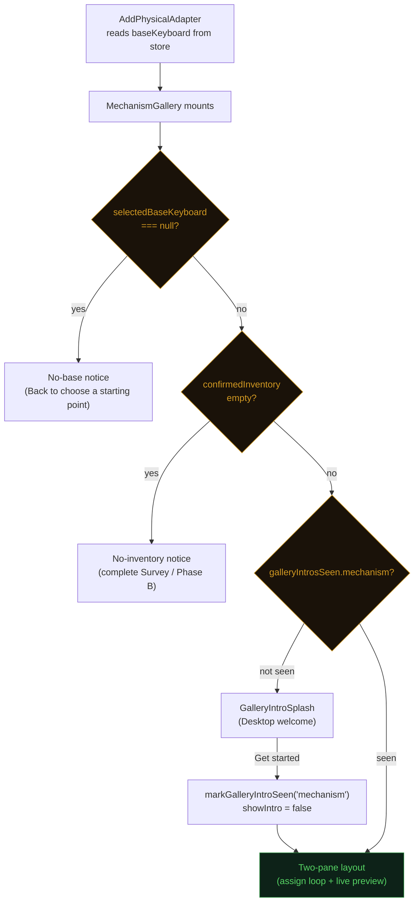
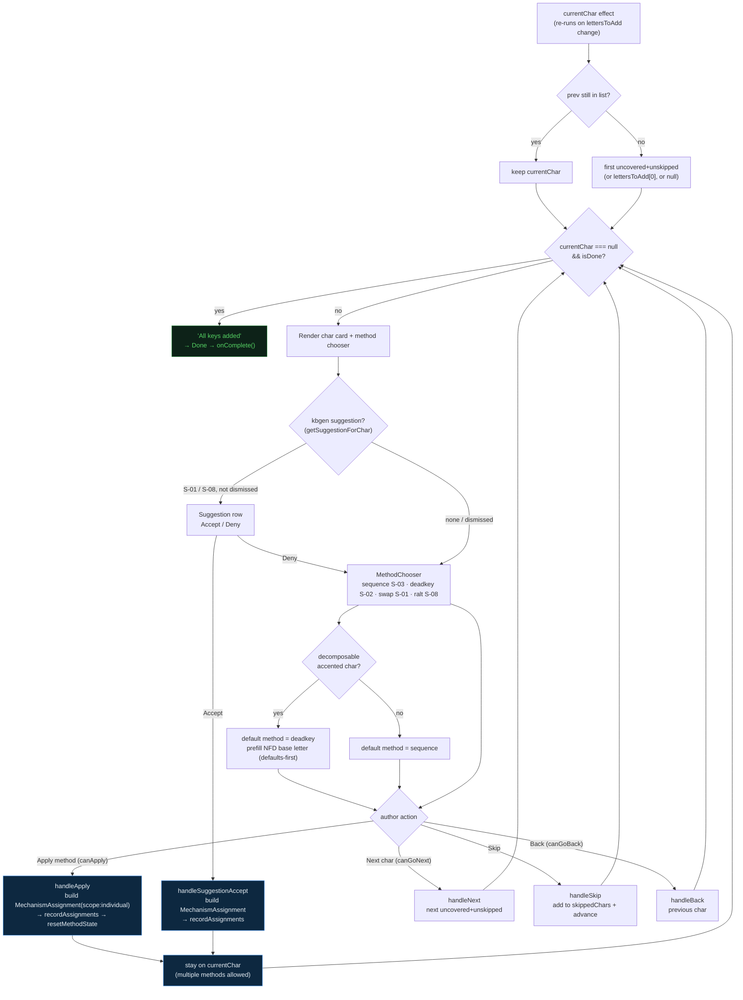
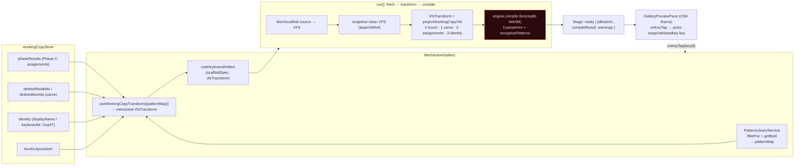
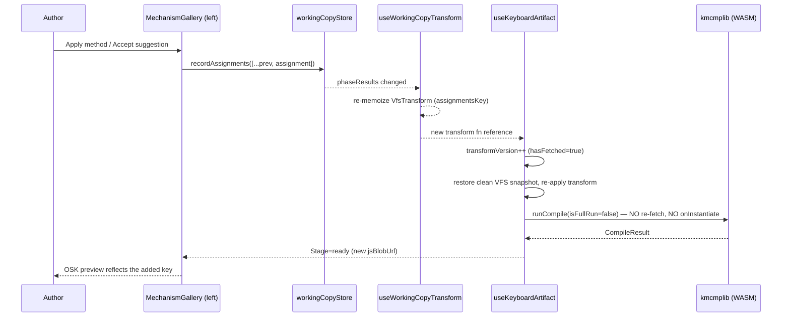
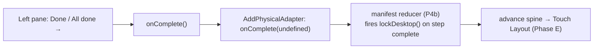

# Mechanism Gallery — workflow diagram

> Flow reference for [MechanismGallery.tsx](../../packages/studio/src/editors/assignLoop/MechanismGallery.tsx)
> (Phase C — desktop "add a key" loop). Drawn ahead of the planned
> `AssignLoopShell` extraction so the moving parts are visible before the
> refactor merges. Mermaid (renders in GitHub).

The gallery is two cooperating machines sharing one component:

1. a **left-pane UI state machine** that walks the author character-by-character
   through `lettersToAdd`, recording `MechanismAssignment`s; and
2. a **right-pane compile pipeline** that re-projects the working copy into a
   live OSK preview on every assignment change.

They are coupled only through the working-copy store: the left pane writes
assignments via `recordAssignments`, the store change re-memoizes the
`VfsTransform`, and the pipeline recompiles. There is **one** WASM compile for
Phase C (single-artifact invariant, decision D3) — owned here, not by the outer
`SurveyView`.

---

## 1. Mount, guards & intro (entry lifecycle)

`showIntro` seeds from the persisted `galleryIntrosSeen.mechanism` flag, so the
splash shows once per working-copy session and survives navigating to the Touch
gallery and back.

---

## 2. Left pane — the per-character assign loop (UI state machine)

`currentChar` is **explicit state**: applying a method does *not* auto-advance.
Only `Next`, `Skip`, or `Back` move the cursor. Done = every char in
`lettersToAdd` is covered (≥1 assignment) or skipped.

Notes that matter for the refactor:

- **`Apply` does not advance.** The author may stack several methods on one
  character; the applied-methods chip row lets them remove individual
  mechanisms. `canGoNext` is gated on `appliedForCurrentChar > 0`.
- **Skipped chars count toward Done** but are not covered — they're tracked in
  local `skippedChars` state, *not* the store, so they reset on remount.
- **`desktopLocked`** disables every write affordance but always leaves
  `onComplete` callable (forward escape after navigating back from Phase E).
- **kbgen suggestion** only fires for S-01 / S-08 candidates; any other
  `strategyId` is dismissed with a warning. No placement map → no row → gallery
  behaves exactly as before.

---

## 3. Right pane — live preview compile pipeline (data flow)

The **recompile loop** (no re-fetch) is the part most worth understanding before
the refactor touches it:

Why `isFullRun=false` matters: a full run re-fetches the source and fires
`onInstantiate`, which would pop the "switching base keyboards" confirmation on
every keystroke. Assignment changes must take the cheap transform-only path.

---

## 4. Exit / completion

Per [registerEditorSteps.ts](../../packages/studio/src/steps/registerEditorSteps.ts),
the `mechanisms` step writes `groups[] / stores[]` (`ADD_GALLERY_WRITES`) and the
reducer fires `lockDesktop()` when it completes. The lock-related side effects
currently noted as living in `StudioShell` migrate into the manifest reducer in
P4b.

---

## Refactor-relevant seams

The file header already flags the planned extraction. The seams a refactor will
cut along:

| Seam | Today | Notes for the refactor |
|------|-------|------------------------|
| **Shell vs behavior** | `MechanismGallery` + `TouchGallery` duplicate a header + left + right two-pane shell | Planned `AssignLoopShell` (surface-parameterized) with `physicalBehavior.ts` / `touchBehavior.ts` (P4a/P4b) |
| **Pattern IDs** | `PATTERN_*` constants must match `content/patterns/` `id:` fields | A mismatch makes `getById()` return undefined → preview never reflects the key. Keep these in lock-step. |
| **Method → assignment** | `handleApply` / `handleSuggestionAccept` each hand-build slotValues per method | Candidate for a shared `buildAssignment(method, ...)` factory — the two paths already drift (suggestion path only covers S-01/S-08) |
| **Compile ownership** | `MechanismGallery` owns the single pipeline; `SurveyView`'s hook stays mounted but unrendered | Single-artifact invariant (D3). Any refactor must not introduce a second concurrent compile. |
| **Skipped state** | local `skippedChars`, not persisted | If the loop becomes resumable, this needs to move to the store. |
