# Design Note — Survey Flow Rework (Proposal)

> **Status: PROPOSAL / design note — not a spec change.** Investigated this
> session on branch `km/inventory-delta`. This note does not edit [spec.md](../../spec.md)
> or anything under the specs/ folder; it is the record of a rework worth
> discussing before any of it becomes a `/speckit-specify` feature. All
> file/subsystem references below were verified against the live tree while
> writing this note (not carried over from an earlier draft).

---

## Background / problem

Today's survey spine is the single ordered list in
[packages/studio/src/steps/manifest.ts](../../packages/studio/src/steps/manifest.ts):

```
identity → choose_base → track → [project_name, off-spine] →
characters → carve → mechanisms [lock:physical] →
[touch_seed_source, off-spine] → touch [lock:touch] → help → package
```

`characters` is one opaque editor-step. Its component,
[CharactersStep.tsx](../../packages/studio/src/survey/CharactersStep.tsx), owns a
private `prefill → PhaseB` substage machine; the entire ~55-question Phase-B
battery runs *inside* that one step, ordered by
[content/flows/phase_b_characters.modular.yaml](../../content/flows/phase_b_characters.modular.yaml)
and routed at runtime by the SurveyRunner's `FlowDef`. From the manifest's own
comment: `characters` is declared as a single "spine placeholder" precisely so
"the actual question ordering within Phase A/B is handled by the SurveyRunner
... rather than expanded step-by-step in the manifest."

The problem: that one step interleaves three distinct activities that the
manifest, the dashboard, and the author never see as separate:

1. **Discovery** — *how* do you want to tell us your alphabet (paste a text
   sample, accept a suggested list, browse a picker, or answer step by step)?
2. **Inventory** — *what* letters, marks, digits, and punctuation does the
   language need?
3. **Strategy** — *how* are those characters typed (deadkey vs. sequence vs.
   mnemonic spelling; prefix vs. postfix mark order; where the spare keys
   live)?

Activity 3 is the [spec.md](../../spec.md) §7 A1–A7 → S-01..S-13 framework
(extracted to [specs/007-strategy-selection/spec.md](../../specs/007-strategy-selection/spec.md)),
and it is not surfaced as a set of explicit, approvable decisions at all —
it is buried inside individual gated Phase-B questions
(`pb_typing_approach`, `pb_mark_input_order`, `pb_mark_style`, ...) whose
answers quietly become axis values (A3, A3a, A4) consumed later by
[packages/engine/src/strategy-selector/rules.ts](../../packages/engine/src/strategy-selector/rules.ts).
The author never sees "you are getting deadkey composition (S-02) because of
these three answers" as a single reviewable moment.

---

## (a) The reworked 8-act flow

Nine named stages fall out of this rework, of which eight are designed here;
the ninth (**Deliver**) stays reserved and out of scope for v1, exactly as
today's `package` step already is (see the `packageStep` comment in
[manifest.ts](../../packages/studio/src/steps/manifest.ts): "reserved, out of
scope for v1"). Calling this "the 8-act flow" refers to the eight acts that
actually get designed; Deliver is carried along unchanged from today's
spine, not newly scoped.

**The only structural change versus today's spine** is splitting the opaque
`characters` step into an inventory act and a strategy-approval act, with
`carve` sitting between them exactly where it does today:

```
Frame → Choose base → Give alphabet (Discovery, Inventory) → Carve →
Approve strategies → Overlay onto keys → Touch overlay →
Prove & document → [Deliver, reserved]
```

"Give alphabet" is itself two sub-acts (discovery, then inventory
confirmation) — the split lands right after Choose base, which is the
"Act 2/3" shorthand for this: Choose base is Act 2, and the two halves of
the old `characters` blob become Act 3's two sub-acts. Everything else
(Carve, Mechanisms, Touch, Help, Package) keeps its current position.

```mermaid
flowchart LR
    A1["Act 1<br/>Frame"] --> A2["Act 2<br/>Choose base"]
    A2 --> A3a["Act 3a<br/>Give alphabet — Discovery"]
    A3a --> A3b["Act 3b<br/>Give alphabet — Inventory"]
    A3b --> A4["Act 4<br/>Carve"]
    A4 --> A5["Act 5<br/>Approve strategies"]
    A5 --> A6["Act 6<br/>Overlay onto keys"]
    A6 --> A7["Act 7<br/>Touch overlay"]
    A7 --> A8["Act 8<br/>Prove & document"]
    A8 --> A9["Act 9<br/>Deliver (reserved)"]

    classDef today fill:#dde9ff,stroke:#3060c0,color:#000
    classDef changed fill:#fff2cc,stroke:#b58900,color:#000
    classDef reserved fill:#f5f5f5,stroke:#999,color:#666
    class A1,A2,A4,A6,A7,A8 today
    class A3a,A3b,A5 changed
    class A9 reserved
```



| Act | Name | Purpose | Mostly | Driving facet families |
|---|---|---|---|---|
| 1 | Frame | Identity metadata + track (copy vs. adapt) choice; `project_name` joins here off-spine | asked, with proposals | `author` (authority, expertise, github-presence), `lineage` (siblings, nearest-neighbors) |
| 2 | Choose base | Rank and confirm the base keyboard | proposed | `env` (base-layout-affinity, os-ecosystem, device-mix), `lineage` (nearest-neighbors, siblings, placement-priors) |
| 3a | Give alphabet — Discovery | Choose *how* to supply the alphabet (text sample, suggested list, picker, step by step) | asked (method), then computed | `orth` (inventory-delta as the underlying engine), `community` (orthography-maturity) |
| 3b | Give alphabet — Inventory | Confirm *what* characters/marks/digits/punctuation the language needs | asked today; proposed once wired | `orth` (inventory-delta, diacritic-density, regional-variant), `community` (multi-orthography) |
| 4 | Carve | Remove unneeded base keys | asked/confirmed | `orth` (inventory-delta complement) |
| 5 | Approve strategies | Confirm *how* characters are typed — the heart of this rework | proposed | `orth` (mark-composition-posture, diacritic-density, direction), `lineage` (strategy-fingerprint, nearest-neighbors, siblings, placement-priors — currently blocked, see (c)), `community` (input-conventions, muscle-memory, multi-orthography) |
| 6 | Overlay onto keys | Place characters on physical keys (Mechanisms gallery, `lock:physical`) | proposed, then confirmed | `lineage` (placement-priors), `env` (base-layout-affinity) |
| 7 | Touch overlay | Seed + refine the touch surface (`lock:touch`) | proposed (`touchSuggest`), then confirmed | `env` (device-mix, form-factor, connectivity), `dest` (delivery-channel) |
| 8 | Prove & document | Help docs + (proposed) acceptance-test confirmation | asked (help text), proposed (acceptance vectors) | `dest` (delivery-channel, license-maintenance), `author` (github-presence for credits) |
| 9 | Deliver | Packaging/publish | reserved, out of scope for v1 (unchanged) | — |

### Act 5 — Approve strategies, in detail

This is the act that does not exist today; everything in it is currently
smeared across individual Phase-B questions inside the opaque `characters`
step.

**5a — Global posture.** Two confirmations, not two blind questions:
remap posture (A7a — "will most keys keep their base-layout letter, or is
this a full remap?") and mental model (A3/A3a — phonetic-spelling vs.
lookalike vs. modifier-then-base, and prefix-vs-postfix mark order). These
map directly onto today's `pb_typing_approach` and `pb_mark_input_order`,
reframed as a single "here's the posture we're assuming" screen instead of
two sequential radio questions buried mid-battery.

**5b — Per-behavior strategy cards.** Each card proposes a specific `S-0x`
from the decision tree
([specs/007-strategy-selection/spec.md](../../specs/007-strategy-selection/spec.md) §7.2,
resolved by [packages/engine/src/strategy-selector/rules.ts](../../packages/engine/src/strategy-selector/rules.ts)),
offers 2-3 valid alternatives, and shows a live preview (the vendored
`simulate()` path is the natural preview engine here — see the "simulate()
API vendored" project note). This is the ~30-modules-into-~5-8-cards
collapse detailed in (d)(2) below.

**5c — Per-character worklist → mechanisms.** Once the global posture and
per-behavior cards are confirmed, the confirmed inventory (from Act 3b) is
walked character-by-character to assign each one's specific mechanism —
functionally a preview of what Act 6's Mechanisms gallery will do, surfaced
here as "here is the plan" before Act 6 does "now place the keys."

---

## (b) Core reframe: defaults are the product

[spec.md §3c](../../spec.md) is explicit: *"Naive users accept reasonable
defaults and do not question them. The studio's value sits in the defaults,
not the override controls."* Every screen in the reworked flow is a
**proposed answer rendered as an editable confirmation**, never a blank
question. A true open question fires only when no signal exists to propose
from.

The facet catalog at [content/facets/](../../content/facets/) exists
specifically to feed these proposals — its own README states the rule
plainly: *"A facet earns its place in this catalog by the survey questions
it prefills (or eliminates)... A facet that consumes nothing is decoration
and should be retired."*

`orth.inventory-delta` ([content/facets/orth/inventory-delta.yaml](../../content/facets/orth/inventory-delta.yaml))
is the clearest illustration: on its own it declares `prefills` for exactly
eight questions — `pb_char_count`, `pb_standard_letters`, `pb_special_letters`,
`pb_special_letters_list`, `pb_spare_keys_qwerty`, `pb_spare_keys_azerty`,
`pb_punctuation_gate`, `pb_digit_set` — plus two non-question proposal sites
(`axis:A1`, `placement:character-worklist`). One computed facet, eight
questions turned from blank fields into confirmations.

(One correction while verifying: the working assumption going into this
session was a 24-facet catalog. The live count is **23** —
3 in `author/`, 4 in `community/`, 2 in `dest/`, 5 in `env/`, 4 in `lineage/`,
5 in `orth/`. Use 23 going forward.)

---

## (c) Small / medium / big triage

The dividing line running through everything below is the **corpus
keyboard-facet-index**. Verified this session: `specs/036-keyboard-facet-index`
and `specs/037-facet-classifiers` do not exist on disk — there is no
`specs/03x` folder at all yet, no `docs/keyboard-facet-index.json`, no
`utilities/facet-index` generator, and no `content/keyboard-facets/`
directory. So "propose from **precedent**" — the `lineage.*` facets
(`strategy-fingerprint`, `nearest-neighbors`, `siblings`, `placement-priors`)
— is **blocked**: each of those facet records is honestly marked
`sourceStatus: planned` or depends on a corpus aggregation pass that hasn't
been built. "Propose from the §7.2 decision tree + CLDR + base IR" works
**today** — that's the input-contract default-fill machinery already live in
the strategy selector.

A second common blocker runs through everything in BIG: `QuestionModule.mutate()`
is a deliberate stub (`survey/types.ts`), deferred to P5 and gated on the
engine mutation seam — see
[docs/survey-modularity-cyoa-plan.md](../survey-modularity-cyoa-plan.md).
Declaring real `inputs`/`writes` for a question is cheap; making the question
actually populate `KeyboardIR` is not available until P5 lands.

**SMALL** (data/config only):
- Reorder [phase_b_characters.modular.yaml](../../content/flows/phase_b_characters.modular.yaml)
  so the strategy-axis questions (`pb_typing_approach`, `pb_mark_input_order`,
  `pb_mark_style`, `pb_capitals_marks`, `pb_stacking_marks`,
  `pb_accent_marks_gate`, `pb_diacritic_select`) sit together and adjacent to
  the inventory questions they currently interleave with.
- Retire `pb_char_count` (see (d)(1) — it's fully computable from
  `orth.inventory-delta`'s set size).
- Cluster the free-text provenance questions (`pb_existing_keyboards`,
  `pb_co_installed_keyboards`, `pb_legacy_encoding`) — they already sit near
  each other in the YAML; group them explicitly under one discovery-act
  heading.
- A cross-OS modifier help-text note on the eventual RAlt/where-extras-live
  card (macOS Option-key collision) — content-only, since
  `env.os-ecosystem`'s derivation is still `planned`, not wired.
- **Caveat that applies to every spine reorder in this list:**
  `validateManifestShape()` in
  [packages/studio/src/StudioShell.tsx](../../packages/studio/src/StudioShell.tsx)
  hardcodes an `expectedSpine` array — `["identity", "choose_base", "track",
  "characters", "carve", "mechanisms", "touch", "help", "package"]` — and
  throws at runtime if `manifest.ts`'s spine order doesn't match it
  position-for-position. Any change that touches spine shape (including
  eventually splitting `characters` into two manifest steps) must update
  this array in the same change or `SurveyView` breaks immediately.

**MEDIUM**:
- Wire `computeInventoryDelta` — the pure engine function that turns
  `orth.inventory-delta` from a half-computed facet (`suggestMissingCharacters`
  exists; the vs-base delta wiring is `sourceStatus: planned`) into a real
  computed signal. This is the keystone MEDIUM item — see Status below.
- Surface the strategy-selector's resolution
  ([rules.ts](../../packages/engine/src/strategy-selector/rules.ts),
  [default-fill.ts](../../packages/engine/src/strategy-selector/default-fill.ts),
  [import-mark-order.ts](../../packages/engine/src/strategy-selector/import-mark-order.ts))
  as a live Act 5 card default instead of a value the gallery discovers only
  after the fact.
- Acceptance-test vectors via the vendored `simulate()` path — generate
  `Pattern.tests`-shaped `TestVector` entries for the author's *own* keyboard,
  not just the pattern library's canonical fixtures.

**BIG**:
- Actually split the `characters` blob: retire
  [CharactersStep.tsx](../../packages/studio/src/survey/CharactersStep.tsx)'s
  private `prefill → PhaseB` substage machine in favor of real manifest steps
  for Discovery / Inventory / Approve-strategies.
- The strategy-card UI itself — collapsing ~30 Phase-B modules into ~5-8
  cards (see (d)(2)).
- A font-recommendation step (net new; no current facet or step covers it —
  see (e)(1)).

**NOT-TODAY**:
- Precedent pre-selection from the `lineage.*` facets (blocked on the
  facet-index, above).
- `confidenceClass`-gated question suppression — `specs/038` does not exist
  either.
- The §7.5.1 corpus evaluation protocol / corpus scan itself.

---

## (d) Two ledgers

### (d)(1) `pb_*` → act mapping

All 55 questions from
[phase_b_characters.modular.yaml](../../content/flows/phase_b_characters.modular.yaml),
read in full to verify current prompts and routing.

| # | Question | New act | Fate |
|---|---|---|---|
| 1 | `pb_existing_keyboards` | 3a Discovery | stays — free-text advisory, prefilled today by `lineage.siblings` |
| 2 | `pb_co_installed_keyboards` | 3a Discovery | stays — free-text, no facet prefill yet |
| 3 | `pb_discovery_intro` | 3a Discovery | stays — the method chooser itself |
| 4 | `pb_text_sample` | 3a Discovery | stays — feeds `orth.inventory-delta`'s harvest signal |
| 5 | `pb_text_sample_review` | 3a Discovery | stays |
| 6 | `pb_linguist_confirm` | 3a Discovery | stays |
| 7 | `pb_picker_confirm` | 3a Discovery | stays |
| 8 | `pb_routing_branch` | 3a Discovery | stays — engine-resolved, never rendered |
| 9 | `pb_standard_letters` | 3b Inventory | becomes-confirmation — prefilled by `orth.inventory-delta`; only Phase-B module with real declared `writes` today (`stores[]`) |
| 10 | `pb_accent_marks_gate` | 5b accented-letters card | moves-act — A4 gate |
| 11 | `pb_diacritic_select` | 5b accented-letters card | moves-act |
| 12 | `pb_stacking_marks` | 5b accented-letters card | moves-act — A4=stacking-combining test |
| 13 | `pb_mark_style` | 5b accented-letters card | moves-act — precomposed-vs-combining branch |
| 14 | `pb_capitals_marks` | 5b accented-letters card | moves-act — pattern-slot detail, not inventory |
| 15 | `pb_typing_approach` | 5a global posture | moves-act — A3 |
| 16 | `pb_mark_input_order` | 5a global posture | moves-act — A3a |
| 17 | `pb_special_letters` | 3b Inventory | becomes-confirmation — prefilled by `orth.inventory-delta` |
| 18 | `pb_special_letters_list` | 3b Inventory | becomes-confirmation — prefilled by `orth.inventory-delta` |
| 19 | `pb_special_letters_notes` | 3b Inventory | stays — free text, no facet home |
| 20 | `pb_latin_digraphs_gate` | 5b digraphs card | moves-act — is-it-one-key is a mechanism decision |
| 21 | `pb_latin_digraphs_list` | 5b digraphs card | moves-act |
| 22 | `pb_punctuation_gate` | 3b Inventory | becomes-confirmation — prefilled by `orth.inventory-delta` |
| 23 | `pb_punctuation_list` | 3b Inventory | stays |
| 24 | `pb_digit_set` | 3b Inventory | becomes-confirmation — prefilled by `orth.inventory-delta` |
| 25 | `pb_char_count` | — | **retires** — computed directly from `orth.inventory-delta`'s size (drives A1) |
| 26 | `pb_latin_qwerty_branch` | 5b where-extras-live card | moves-act — A7 spare-key probe |
| 27 | `pb_spare_keys_qwerty` | 5b where-extras-live card | moves-act — prefilled by `orth.inventory-delta`'s complement |
| 28 | `pb_latin_azerty_branch` | 5b where-extras-live card | moves-act |
| 29 | `pb_azerty_qz_swap` | 5b where-extras-live card | moves-act |
| 30 | `pb_spare_keys_azerty` | 5b where-extras-live card | moves-act |
| 31 | `pb_non_roman_branch` | 3b Inventory | stays — script-family router |
| 32 | `pb_indic_conjuncts` | 5b Indic/SEA cluster card | moves-act — gates A2a directly |
| 33 | `pb_indic_virama` | 5b Indic/SEA cluster card | moves-act — names the S-09 pattern's virama slot |
| 34 | `pb_indic_vowels_separate` | 5b Indic/SEA cluster card | moves-act |
| 35 | `pb_indic_pre_base_vowels` | 5b Indic/SEA cluster card | moves-act |
| 36 | `pb_indic_nukta_gate` | 5b Indic/SEA cluster card | moves-act |
| 37 | `pb_indic_nukta_detail` | 5b Indic/SEA cluster card | moves-act |
| 38 | `pb_indic_vowels_onset` | 5b Indic/SEA cluster card | moves-act |
| 39 | `pb_indic_vowels_onset_list` | 5b Indic/SEA cluster card | moves-act |
| 40 | `pb_sea_medials` | 5b Indic/SEA cluster card | moves-act |
| 41 | `pb_sea_stacked_consonants` | 5b Indic/SEA cluster card | moves-act |
| 42 | `pb_rtl_direction_confirm` | 3b Inventory | stays — no Act 5 card proposed this round (gap, not a decision) |
| 43 | `pb_rtl_short_vowels` | 3b Inventory | stays — same gap |
| 44 | `pb_rtl_direction_marks` | 3b Inventory | stays — same gap |
| 45 | `pb_rtl_direction_marks_detail` | 3b Inventory | stays — same gap |
| 46 | `pb_rtl_special_letters` | 3b Inventory | stays |
| 47 | `pb_syllabic_note` | 3b Inventory | stays — same gap |
| 48 | `pb_syllabic_grid` | 3b Inventory | stays — same gap |
| 49 | `pb_syllabic_finals_gate` | 3b Inventory | stays — same gap |
| 50 | `pb_syllabic_finals_detail` | 3b Inventory | stays — same gap |
| 51 | `pb_other_free_entry` | 3b Inventory | stays |
| 52 | `pb_contact_language` | 3b Inventory | stays — loanword/name coverage, inventory-adjacent |
| 53 | `pb_legacy_encoding` | 3a Discovery | stays — prefilled by `lineage.siblings` (a Frame-act facet feeding forward into Discovery) |
| 54 | `pb_use_case` | 8 Prove & document | moves-act — feeds help-doc framing / `dest.delivery-channel` |
| 55 | `pb_additional_methods` | 3a Discovery | stays — loop back to add via another method |

Tally: 1 retires, 24 move-act (7 accented-letters + 2 digraphs + 5
where-extras-live + 10 Indic/SEA cluster), 1 moves to Act 8, 19 stay in 3b
Inventory, 10 stay in 3a Discovery. 1+24+1+19+10 = 55.

Note the RTL/syllabic sub-branch questions (rows 42-50) are a deliberate
**gap**, not a symmetry decision: they describe script structure the S-09
pattern would need exactly the way the Indic/SEA questions do, but this round
only proposes an Indic+SEA cluster card, not an RTL or syllabic one. That
asymmetry should be revisited before this ships.

### (d)(2) Card inputs/writes ledger

The paper version of the ~30-modules-into-~5-8-cards collapse. Read the
actual module files under
[packages/studio/src/survey/questions/b/](../../packages/studio/src/survey/questions/b/)
rather than assuming.

**The headline finding:** every module below declares `inputs: []` and
`writes: []` today — verified by opening each file. `pb_standard_letters` is
the sole exception in the entire Phase-B battery (it declares
`inputs: [irPath("header", "bcp47")]`, `writes: [irPath("stores", ARRAY_INDEX)]`),
and it is an Inventory-act module, not a candidate for any of these cards.
So the "paper collapse" below is not a migration of existing declarations —
there is nothing to migrate. It is a proposal for what each card's
declarations *would* need to be authored as, from scratch, once P5's mutate
seam exists.

| Card | Absorbs (`pb_*`) | Declared `inputs`/`writes` today | Proposed target once wired |
|---|---|---|---|
| **Accented/diacritic letters** | `pb_accent_marks_gate`, `pb_diacritic_select`, `pb_stacking_marks`, `pb_mark_style`, `pb_capitals_marks` (5 modules) | all `inputs: []`, `writes: []` | writes: `stores[]` (mark tables) + `groups[]` (deadkey rule group), mirroring `pb_standard_letters`'s pattern; inputs: `header.bcp47` + the Act 3b confirmed-letters answer |
| **Mark input order & composition** | `pb_typing_approach`, `pb_mark_input_order` (2 modules) | both `inputs: []`, `writes: []` | **not a clean `IRPath` target** — A3/A3a live on the strategy-selector's axis vector (`irAxes`/`markInputOrder` on `SurveyPhaseResult`), not on `KeyboardIR` directly. This card's "write" is an axis value, not an IR path — flagged as an open design question for the P5 mutate-seam work, not solved here |
| **Cluster/conjunct rules (Indic + SEA)** | `pb_indic_conjuncts`, `pb_indic_virama`, `pb_indic_vowels_separate`, `pb_indic_pre_base_vowels`, `pb_indic_nukta_gate`, `pb_indic_nukta_detail`, `pb_indic_vowels_onset`, `pb_indic_vowels_onset_list`, `pb_sea_medials`, `pb_sea_stacked_consonants` (10 modules) | all `inputs: []`, `writes: []` | writes: `groups[]` (the S-09 reorder group) + `stores[]` (consonant/vowel/nukta tables); inputs: the Act 3b confirmed inventory + `header.bcp47` |
| Tone cycle | none today — TODO | — | A4=replacing-cycling is explicitly Phase-C-gated per [specs/007-strategy-selection/spec.md](../../specs/007-strategy-selection/spec.md) §7.5; no `pb_*` module exists to absorb |
| Dual-orthography toggle | none today — TODO | — | A5=two-orthography is also Phase-C-gated per the same §7.5 note; `community.multi-orthography` is the facet that would eventually drive it |
| Feedback loudness | none today — TODO | — | A6 (loud/soft/none) is also Phase-C-gated |
| Where-extras-live (RAlt/AltGr) | `pb_latin_qwerty_branch`, `pb_spare_keys_qwerty`, `pb_latin_azerty_branch`, `pb_azerty_qz_swap`, `pb_spare_keys_azerty` — TODO, not opened for this pass | — | see (d)(1) row 26-30 for the absorption call; inputs/writes not verified this session |
| Digraphs | `pb_latin_digraphs_gate`, `pb_latin_digraphs_list` — TODO, not opened for this pass | — | see (d)(1) row 20-21 |

---

## (e) Facet-list gaps

Five things the (verified) 23-facet catalog does not model:

1. **Display/bundled font.** Especially for complex scripts — a `.kps`
   ships a font today, but no facet proposes or validates the choice. Would
   need a new `dest.*` or `orth.*` facet (e.g. `dest.bundled-font` or
   `orth.script-rendering-requirements`).
2. **Acceptance test vectors.** `Pattern.tests` exists
   ([packages/contracts/src/pattern.ts](../../packages/contracts/src/pattern.ts),
   the `TestVector` type) but is discovery-only today — it gates a pattern's
   admission to the library, not the author's own finished keyboard. A
   "prove it types these" Act 8 step, feeding user-specific `TestVector`
   entries, is the natural home.
3. **Cross-OS modifier equivalence.**
   [content/facets/env/os-ecosystem.yaml](../../content/facets/env/os-ecosystem.yaml)
   names the OSes (windows/macos/linux/android/ios/chromeos) and proposes a
   "modifier-idiom" site, but does not model the actual RAlt↔Option↔ChromeOS
   behavioral equivalence — that logic doesn't exist anywhere yet. Extend
   `env.os-ecosystem` or add a dedicated `env.modifier-equivalence` facet.
4. **Supersession/versioning intent.**
   [content/facets/lineage/siblings.yaml](../../content/facets/lineage/siblings.yaml)
   knows a sibling keyboard exists (and proposes a collision warning) but has
   no field for "am I intentionally replacing published keyboard X." Extend
   `lineage.siblings` with a `supersedes` field, or add `lineage.supersession`.
5. **System-shortcut collision safety.** A full remap or an RAlt-heavy plane
   can steal OS-level Ctrl/Cmd shortcuts. Verified: no existing
   `packages/contracts/data/criteria.json` check covers this today. Needs a
   new lint-style criterion plus a supporting `env.*` facet
   (e.g. `env.os-ecosystem-shortcuts`) to feed it.

---

## Status / next steps

This is a proposal, not a plan of record. The first concrete build step
landing alongside this note is the pure `computeInventoryDelta` engine
function — the MEDIUM keystone in (c), and the thing `orth.inventory-delta`
is waiting on to move from `sourceStatus: planned` to `available`.

The safe phased path for the rest, in order:

1. **Split to `SurveyPhaseResult` first** — behavior-preserving: reshape
   `characters` into Discovery/Inventory/Approve-strategies manifest steps
   without changing what gets written where, guarded by a future Phase-B
   golden snapshot (the same kind of harness `flow-parity.test.ts` already
   runs for Phase A/F/identity-lite, per
   [docs/survey-modularity-cyoa-plan.md](../survey-modularity-cyoa-plan.md)).
2. **Cards on top** — build the Act 5 strategy-card UI against the
   now-real Discovery/Inventory split, using the (d)(2) ledger as the
   authoring guide.
3. **Switch on IR-emit** — only once the P5 mutate seam lands does any of
   this actually populate `KeyboardIR`; until then, steps 1 and 2 change what
   the author sees and confirms, not what gets written.
