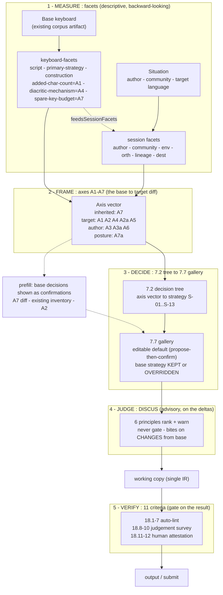

# How the four analytic lenses compose

**Status:** composition / meta-flow reference. Keyboard Studio analyses every
authoring decision through four lenses — the **keyboard-facets**, the **§7.1
discovery axes**, the **DISCUS** principles, and the **§11 criteria**. They are
often described separately, which makes them look like four competing frameworks.
They are not: they are **one flow**, framed by a single question — *what did the
base keyboard already decide, versus what are you authoring in the new keyboard?*
— and unified by the survey/working-copy spine. This document is the map of how
they fit together. Detail lives at the linked homes ([spec.md §7](../spec.md),
[docs/discus-principles-integration.md](discus-principles-integration.md),
[docs/workflow-model.md](workflow-model.md),
[packages/contracts/data/criteria.json](../packages/contracts/data/criteria.json));
this file links rather than restates.

This model was developed with the team on 2026-07-21 against
[specs/007-strategy-selection](../specs/007-strategy-selection/spec.md),
[docs/discus-principles-integration.md](discus-principles-integration.md),
[packages/contracts/data/criteria.json](../packages/contracts/data/criteria.json),
[content/facets](../content/facets) + [content/keyboard-facets](../content/keyboard-facets),
and [docs/workflow-model.md](workflow-model.md).

## The one frame: base-decided vs authored-in-the-new-keyboard

Every keyboard the studio produces is a **specialization of a base keyboard**.
The base already made a pile of decisions — which script, which primary strategy,
how it constructs characters, how many spare keys it has. The author's job is to
decide which of those to **keep** and which to **change** to serve a new target
orthography. The four lenses each look at that same keep-or-change decision from a
different angle, and each runs at a single decision node:

| Lens | Verb | Looks at | Home |
|---|---|---|---|
| Keyboard-facets | **MEASURE** | what the base decided; the situation to serve | [content/keyboard-facets](../content/keyboard-facets), [content/facets](../content/facets) |
| §7.1 discovery axes A1–A7 | **FRAME** | the base→target diff, axis by axis | [spec.md §7.1](../spec.md) / [specs/007](../specs/007-strategy-selection/spec.md) |
| §7.2 tree → §7.7 gallery | **DECIDE** | which strategy to keep or override | [spec.md §7.2 / §7.7](../spec.md) |
| DISCUS | **JUDGE** | the quality of the deltas (advisory) | [docs/discus-principles-integration.md](discus-principles-integration.md) |
| §11 criteria | **VERIFY** | the finished artifact (the gate) | [criteria.json](../packages/contracts/data/criteria.json) |

## The five-verb flow

### 1. MEASURE — keyboard-facets (descriptive, backward-looking)

Facets **read** what already exists; they decide nothing. **Keyboard-level facets**
describe what the *base* decided — script, primary-strategy, construction — and three
of them are, literally, axis values: **added-char-count = A1**, **diacritic-mechanism
= A4**, **spare-key-budget = A7** (classified in
[content/keyboard-facets](../content/keyboard-facets) +
[utilities/facet-index](../utilities/facet-index), see
[specs/043-base-selection-facets](../specs/043-base-selection-facets/spec.md)).
**Session/input facets** (author, community, environment, orthography, lineage,
destination, source) describe the *situation* the new keyboard must serve.
`feedsSessionFacets` is the one-way bridge that pre-seeds session-facet defaults
from base facts — the only place the two families connect.

### 2. FRAME — the §7.1 discovery axes A1–A7 (the base↔target diff)

The axes are the **load-bearing lens for the base-vs-new question**. You cannot
diff a base's `.kmn` against a target orthography directly, but you *can* diff them
axis by axis. The axis vector is populated from the base IR/recognizer, the survey
confirmations for the target/author, and script-class prior default-fills. Crucially,
the axes split by **where each decision comes from** — see the axis-provenance table
below.

### 3. DECIDE — the §7.2 tree → §7.7 gallery

The [§7.2 decision tree](../spec.md) consumes the A1–A7 (+ A2a/A3a/A7a) vector and
emits a `StrategyRecommendation`: the primary strategy **S-01..S-13** by first-match
over rules 1, 2, 3, 3a, 4, 5, 6, 7, 8 → 11 → 12, with secondaries via rules 9 and 10.
The base strategy is **kept** where the target meets the base on every axis that a
strategy touches, and **overridden** where an axis diverges. The [§7.7 gallery](../spec.md)
surfaces the result as an *editable default* (§3c propose-then-confirm). **S-13
touch-layer-switch** is chosen *outside* the tree — it is triggered by a multi-entry
touch-layer array, not by an axis rule.

### 4. JUDGE — DISCUS (advisory, on the deltas)

The six DISCUS principles — Discoverability, Intuition, Simplicity, Consistency,
Usability, Standards — **rank the gallery and warn**; they **never gate**. They bite
hardest on decisions **changed from the base**, which is exactly where authoring risk
concentrates. See [docs/discus-principles-integration.md](discus-principles-integration.md)
for the principle→heuristic mapping.

### 5. VERIFY — the §11 criteria (the gate on the result)

The [§11 criteria](../packages/contracts/data/criteria.json) verify the finished
artifact in three bands:

- **18.1–18.7 — auto-lint** `KM_*` (touch heuristics 18.1–18.5, inventory-coverage
  18.6, mandated-currency 18.7).
- **18.8–18.10 — yellow-survey** judgement questions (recorded, not auto-derived).
- **18.11–18.12 — red-checklist** human attestation.

This is the only lens that gates, and it gates the *output*, not the decisions —
which is why it can be a hard check where DISCUS cannot.

## The flow, as one diagram



## Axis provenance — who decided each axis

The axes are not one homogeneous set. Each answers the keep-or-change question from
a different source of authority, and that provenance is what makes the FRAME lens
load-bearing. The axis vector is populated from the base IR/recognizer (the inherited
values), the survey confirmations (the target- and author-driven values), and
script-class prior default-fills.

| Axis | What it captures | Provenance |
|---|---|---|
| **A1** | scale (added-char-count) | required by the target orthography |
| **A2** | script class | required by the target orthography |
| **A2a** | cluster sensitivity | required by the target orthography |
| **A3** | phonetic intuition | the author's call |
| **A3a** | mark-order (prefix/postfix) | the author's call |
| **A4** | diacritic behavior | required by the target orthography |
| **A5** | multi-mode | required by the target orthography |
| **A6** | constraint enforcement | the author's call |
| **A7** | spare-key budget | **inherited from the base** |
| **A7a** | full-remap vs additive | the **base↔target posture** (the relationship itself) |

So: **A7** is the one axis inherited straight from the base; **A1/A2/A4/A2a/A5** are
dictated by the target orthography; **A3/A3a/A6** are the author's discretionary
calls; and **A7a** describes the *posture* of the whole base→target relationship,
not either endpoint.

## The spine that unifies it

The five-verb flow above describes **one node**. The whole authoring session is the
**CYOA survey spine** — the ordered chain of nodes:

```
identity → base → inventory → physical carve/add → LOCK → touch carve/add → LOCK → docs → publish
```

The **working-copy IR** (a single persistent `KeyboardIR`, v1.3.0 — see
[docs/workflow-model.md](workflow-model.md)) is the accumulator threaded through
every node. Because the survey is **monotonic specialization** — every prefix of
the spine is itself a complete, shippable keyboard — the **base is simply the
spine's origin**. "Inherited vs authored" is then just *how far down the spine you
have walked*: upstream nodes hold base decisions as confirmed defaults, and every
node you touch converts one inherited decision into an authored one.

**Key resolution: no separate provenance-badging system is needed.** The **locks**
are the spine's segment boundaries, and the lock/staleness dependency graph
(each node's declared `inputs`/`writes`) *already* carries provenance. "Inherited
from base / changed by you" is a **read of that graph** — provenance-per-node is
staleness-per-node. Two further alignments fall out of the same structure:

- **Side-trails == conditional axis gating.** The CYOA fork-and-rejoin side-trails
  are exactly the [§7.2](../spec.md) conditional axis gates: **A3a** fires only on
  `A2 = alphabetic ∧ A3 = strong`; **A2a** gates rule 2; **A7a** gates rule 8.
- **Touch = the flow run a second time.** Carve/add is surface-parameterized;
  crossing the physical→touch lock re-runs MEASURE→FRAME→DECIDE on the touch
  surface, **seeded** from the locked physical result (physical→touch propagation
  with per-key provenance).

## The convergence hazard

The four lenses share vocabulary, and shared vocabulary that is **copied** rather
than **referenced** can drift. The real hazard the 2026-07-21 DISCUS↔facets audit
found is *not* DISCUS/facets duplication (they are complementary — DISCUS judges,
facets measure). Nor is it the axis value sets or the strategy catalog: **those
already have a single source of truth in `packages/contracts`** and the engine
already consumes it.

- the **discovery-axis value sets** (A1–A7a) are the per-axis types on
  `DiscoveryAxisVector` in
  [packages/contracts/src/axes.ts](../packages/contracts/src/axes.ts) — e.g. A4 is
  the `DiacriticBehavior` union (`none | stacking-combining | replacing-cycling |
  multi-family`), A1 is `Scale`, A7 is `SpareKeyAvailability`; and
- the **S-01..S-13** strategy catalog is the `StrategyId` union (with
  `ALL_STRATEGY_IDS`) in
  [packages/contracts/src/strategy.ts](../packages/contracts/src/strategy.ts).

The engine's §7.2 decision tree imports **both** of those directly —
[packages/engine/src/strategy-selector/rules.ts](../packages/engine/src/strategy-selector/rules.ts)
takes `DiscoveryAxisVector` and `StrategyId` from `@keyboard-studio/contracts`
rather than restating them — so the axis→tree path is already referenced, not copied.

The remaining, **narrower** hazard is the straggler consumers that still declare
the same value sets *independently* of those contracts types instead of deriving
from them:

1. the **facet-index classifiers** under
   [utilities/facet-index](../utilities/facet-index) — e.g.
   `diacritic-mechanism-classifier.ts` emits its A4 value as a bare `string` and
   hardcodes the `"stacking-combining" | "replacing-cycling" | "multi-family" |
   "none"` literals rather than typing against `DiacriticBehavior`; and
2. the axis-valued **keyboard-facet definitions** —
   [content/keyboard-facets](../content/keyboard-facets) `*.yaml` (added-char-count
   = **A1**, diacritic-mechanism = **A4**, spare-key-budget = **A7**) — whose
   `limits.values` re-list the same enum by hand (e.g.
   `diacritic-mechanism.yaml` restates the four A4 states).

The drift is worst at **A4 (diacritic-mechanism)**, where the classifier literals
and the facet `limits.values` restate the `DiacriticBehavior` distinctions in two
further places with nothing binding them to the contracts type. The fix is tracked in
[specs/045-lens-vocabulary-source-of-truth](../specs/045-lens-vocabulary-source-of-truth/spec.md):
wire those straggler classifiers and facet YAMLs to derive from the **existing**
contracts enumerations, protected by the compile-time drift-guard pattern that
already binds `Pattern` to its zod schema plus a runtime lockstep test.

## Tracking

This document is tracked by [utilities/spec-trace](../utilities/spec-trace/) as
`docs/lens-model.md`, alongside the spec sections, the extracted feature specs, and
[docs/architecture.md](architecture.md), so drift in this composition layer is
visible rather than silent. Run `node utilities/spec-trace check` after editing it,
and `node utilities/spec-trace acknowledge docs/lens-model.md` to record a
deliberate change.
