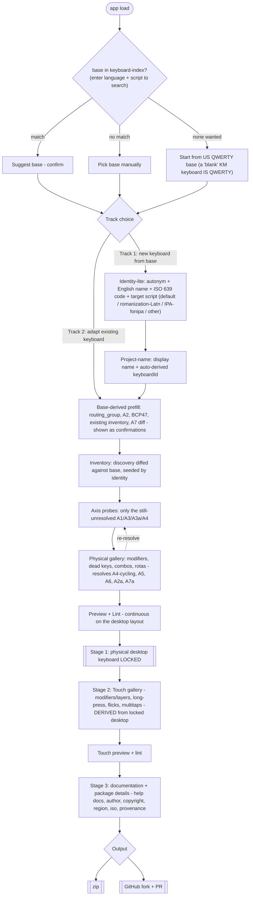

# Authoring workflow — the hybrid flow

**Status:** implemented and ratified. The hybrid ordering + working-copy spine are
specified in [spec.md](../spec.md) §8 and §12 (v1.2.0 + v1.3.0) and are the
authoritative reference. Units 3a–3c and the working-copy spine (P1–P4) are merged.
This file is a supplementary reference — the tables, graphs, and question-level
analysis here remain valid supporting material; [spec.md](../spec.md) §8 is
authoritative.

The hybrid flow is **Track 1** of two authoring tracks that share a single
working-copy spine (v1.3.0). The working copy (`KeyboardIR` + `VirtualFS`) is the
session's single source of truth, instantiated at keyboard selection, mutated by
every subsequent step (carve, survey, gallery, identity edits, OSK edits), and
serialized only at output. No intermediate disk writes occur during authoring.

---

## 1. History — pre-hybrid models

Before the hybrid ordering was adopted (2026-06-13), two earlier models were
documented: the "as-built two-island" state of the SPA (Model 1, existing) and the
intermediate intended model derived from spec §8 before the hybrid ordering was
ratified (Model 2, intended). Both are retained for provenance in
[docs/archive/workflow-models-pre-hybrid.md](archive/workflow-models-pre-hybrid.md).

---

## 2. Shared node vocabulary + I/O contracts

A disconnect is any edge where the source's *produces* doesn't satisfy the target's
*consumes*. A dead-end is any reachable node with no onward path to `Output`.

| Node | Consumes (precond) | Produces (postcond) | Existing status |
|---|---|---|---|
| `SRC` Source / Pick Base | — | `baseKeyboard` | BUILT |
| `IR` Parse to IR | `baseKeyboard` source | `KeyboardIR` | BUILT (on edit) |
| `SCF` Scaffold | `baseKeyboard`,`id`,`name` | `VirtualFS` (+IR) | BUILT |
| `CARVE` Carve gallery | `KeyboardIR` | trimmed IR | STUBBED — no IR producer, no persist |
| `SA` Survey A (identity) | language intent | `identity{lang,bcp47,script,routing}` | BUILT — output discarded |
| `SB` Survey B (characters) | `identity` | inventory + axes A1/A3/A3a/A4(partial)/A7(partial) | PARTIAL (manual only) — discarded |
| `SS` Strategy selector §7.2 | inventory + axes | strategy set S-01..S-12 | ABSENT |
| `GC` Gallery C (deadkey/tone) | strategy set | chosen patterns -> rules; resolves A4-cycling/A5/A6/A2a/A7a | ABSENT |
| `GCp` Gallery C' (reorder/NFD) | inventory | normalization rules | ABSENT |
| `PD` Phase D (desktop OSK) | IR + layout | `.kvks` | ABSENT (scaffolder emits; no UI) |
| `GE` Gallery E (touch) | IR | touch layout | ABSENT |
| `SF` Survey F (help docs) | `identity` | `welcome.htm` / `help/<id>.php` fields | BUILT — discarded |
| `PKG` Package | VirtualFS + survey results | `.kps`,HISTORY,LICENSE,README | AUTO — no survey input wired |
| `PV` Preview + Lint A/B/C | VirtualFS / artifacts | diagnostics | BUILT (A/B) |
| `ZIP` Output: zip | VirtualFS | `.zip` | BUILT |
| `PR` Output: GitHub PR | VirtualFS + OAuth | fork+branch+PR | ABSENT |

---

## 3. The hybrid authoring flow

**Ratified 2026-06-13; working-copy spine + two-track framing ratified 2026-06-14
(v1.3.0); base-first ordering applied editorially 2026-06-14.** The hybrid flow is
the implemented authoring path. It is a **hybrid** of base-first and survey-first:
base resolution comes first, then track choice, then identity-lite + project-name
(Track 1 only), the base back-fills routing, then the heavy character/gallery work,
then deferred paperwork. [spec.md](../spec.md) §8 is authoritative.

### Two authoring tracks, one working-copy spine (v1.3.0)

Every session is anchored to a single **persistent working copy**: a `KeyboardIR` +
`VirtualFS` pair that is instantiated when the keyboard is chosen, mutated by every
subsequent step, and serialized only at output. Two entry tracks converge on a shared
spine after instantiation:

- **Track 1 — new keyboard from a base** (`instantiateFromBase`): after base
  resolution and track choice, collects identity-lite (autonym, English name, ISO 639
  code, target script) and project-name (display name + auto-derived keyboardId),
  copies the base keyboard's IR, resets the identity, and enters the shared spine.
- **Track 2 — adapt an existing keyboard** (`instantiateFromExisting`): after base
  resolution and track choice, loads the existing keyboard's IR with identity
  preserved and enters the shared spine directly — skipping identity-lite and
  project-name because identity is already known. Both tracks converge at
  base-derived prefill.

The OSK is bound to the working copy throughout; it re-renders on every mutation.
Identity edits (language name, script) are visible as OSK mutations on the spacebar
caption. Script, base selection, carve deletions, and mechanism changes alter key
glyphs. Assignments and carve deletions are re-projected layers — not destructive IR
edits.

### The hybrid flow diagram (Track 1 and Track 2)

### Rationale

- **Base resolution first** — the studio looks up a base keyboard immediately (keyed
  on the entered language + script pair), presenting the track-choice prompt as soon
  as a base is confirmed. Identity-lite (autonym, English name, ISO 639 code, target
  script) and project-name (display name + auto-derived keyboardId) follow in Track 1
  only; Track 2 skips both because identity is already known from the existing
  keyboard.
- **Language and script are decoupled.** The keyboard's target is a **(language,
  script) pair**, and the script is an *independent* choice — not derived from the
  language's default. The motivating cases are **romanizations** (a Latin keyboard for
  an otherwise non-Latin language, e.g. `hi-Latn`) and **IPA** (`und-fonipa` /
  `xx-fonipa`), but the rule is general. The chosen script — not the language — drives
  everything downstream: base suggestion keys on the *pair* (a Hindi romanization
  suggests a Latin base, not the Devanagari one), routing (§9) and A2 follow the chosen
  script subtag, and the inventory diff is against the script-appropriate base. BCP47
  carries the pair (`-Latn`, `-fonipa`); identity-lite captures script as its own
  question with the language's default script(s) plus "romanization (Latin)", "IPA",
  and "another script" as first-class options.
- **There is no "blank" base.** A blank Keyman keyboard *is* US QWERTY, so the
  "none wanted" branch starts from the US QWERTY base and back-fills routing the
  same way a suggested/manual base does. All three branches converge on `PREFILL`.
- **Base resolution then back-fills routing** — kills the redundancy in finding (a)
  from §5; `primary_script`/`layout_family`/`A7` become confirmations.
- **Inventory diffed against the base** greys out characters the base already
  produces (the on-ramp reviews already do this — but only if the base is chosen
  *first*).
- **Axis probes pruned** to what the base + discovery didn't already settle.
- **The physical gallery resolves the late axes** and feeds a re-resolve edge back
  to the strategy step — closes finding (c) from §5.
- **Three ordered stages at the tail, never reordered.** Stage 1 fully locks the
  *physical desktop* keyboard (physical gallery + desktop preview). **Only then**
  does Stage 2 derive the touch/mobile layout — its *own* touch gallery, seeded by
  the locked desktop. Mobile is always a downstream transform, never an entry point.
  Stage 3 collects documentation and package metadata (deferred paperwork) last.
- **No mobile-first path exists, by design** (spec Decision 6). The whole survey is
  anchored to physical-keyboard mental models; `pa_primary_target` (desktop / mobile
  / both) is **advisory only** and must not branch the flow into a touch-first
  variant. A "mobile" answer still runs the desktop-first survey and produces the
  touch layout in Stage 2.

---

### The gallery is handled twice (one per modality)

The "gallery" is a **role**, instantiated once per modality with a different input-
mechanism catalog each time. It is not one screen. This is why it appears in both
Stage 1 (physical) and Stage 2 (touch) of the tail.

| | Physical gallery (Stage 1) | Touch gallery (Stage 2) |
|---|---|---|
| Input mechanisms | modifiers (Shift/AltGr), dead keys, combos (chords), rotas (cycling keys) | modifiers + layers, long-press menus, flicks, multitaps, and more |
| Operates on | the physical key grid | the **locked** desktop layout, re-projected to touch |
| Emits | `.kmn` rules + `.kvks` (desktop OSK) | `.keyman-touch-layout` |
| Seeded from | the §7.2 strategy selector (S-01..S-12) | the locked physical layout |
| Spec nodes | `GC` (deadkey/tone), `GCp` (reorder), `PD` (desktop OSK) | `GE` (touch layout) |

Stage 2's "simplify + make visual" work is, concretely, **mapping each physical
mechanism to its touch realization and adding the touch-only affordances**:

| Physical mechanism | Touch realization |
|---|---|
| modifiers (Shift/AltGr) | shift + extra **layers** (S-13) |
| rota (repeat-press cycling, = A4 replacing-cycling / S-07) | the **same KMN rule fires on touch**; **multitap** is an optional second-tap affordance, not the primary realization |
| deadkey | **long-press** menu (`sk` subkeys), or a layer |
| key sequence (context rule) | long-press menu (KMN has no simultaneous-chord primitive) |
| — (no physical analog) | **flicks**, long-press menus |

The correspondence is not 1:1 — flicks and long-press menus have no physical
analog, and KMN has no simultaneous-chord primitive — which is exactly why Stage 2
needs its own gallery rather than a mechanical conversion. Note the S-07 cycle is
*not* a multitap: the desktop cycling rule already fires for touch key events, so it
works on touch unaided; multitap only adds a discrete second-tap affordance. (This
table is mirrored, authoritatively, in spec.md §8 "Gallery instantiation".)

### Gallery output is a scoped, multi-valued assignment map (DISCUS-guided)

The gallery does **not** pick one strategy for the whole keyboard. Its output is an
**assignment map** from key-scope to mechanism(s), at three granularities with
override precedence:

- **keyboard default** — the strategy the §7.2 selector resolves for the inventory
- **character class** — a group (e.g. "tone vowels", "nukta consonants") gets its own
- **individual character** — a single character overrides its class/default

Precedence: **individual > class > default**. And the target→mechanism relation is
**many-to-many**: one character may be reachable by several mechanisms at once (e.g.
a direct key *and* a dead-key sequence *and* a rota position). This holds in **both**
galleries — physical and touch are assigned independently.

**DISCUS drives the suggestions and arbitrates the multiplicity.** The studio
pre-selects a sensible mechanism per scope, ranked by the DISCUS principles already
half-encoded in the §7.1 axes (see [discus-principles-integration.md](discus-principles-integration.md)):

- **Simplicity** — A1 scale gates mechanism complexity; warn on key overload and
  long-press > 8 (criterion 18.1).
- **Consistency** — frequent characters (`InventoryChar.count`) suggested onto easy,
  script-consistent positions (18.10).
- **Discoverability** — rare characters must stay findable; flag any reachable only
  via deep long-press or > 2 modifier hops (18.9 / 18.6).

**Multi-access is the Discoverability-vs-Simplicity tension, and DISCUS is the
arbiter.** More access paths to one character raise Discoverability but cost
Simplicity — so DISCUS *suggests* a second path for a hard-to-reach rare character,
and *warns* when a key is overloaded or a character sits behind too many hops. The
user is free to override either way; the heuristics rank, they don't gate.

**Coverage is the dead-end check.** A confirmed-inventory character with **zero**
assigned mechanisms is a dead-end — uncoverable. Criterion 18.6
(`KM_LINT_INVENTORY_UNCOVERED`) is exactly the verification that every inventory
character has ≥1 reachable mechanism. This is the workflow-graph dead-end test from
§2, applied at the character level: **the assignment map must cover the inventory.**

---

## 4. Survey-question inventory — what each question targets

Read from [phase_a_identity.yaml](../content/flows/phase_a_identity.yaml),
[phase_b_characters.yaml](../content/flows/phase_b_characters.yaml),
[phase_f_helpdocs.yaml](../content/flows/phase_f_helpdocs.yaml). Each question is
tagged by the *job* it does — and critically, by whether its answer is **derivable
from a chosen base keyboard** (because that determines whether it should be asked
or merely confirmed).

### Phase A does four distinct jobs

| Job | Questions | Targets | Gates Phase B? | Derivable from base? |
|---|---|---|---|---|
| **Routing** (build-critical) | `primary_script`, `writing_direction`, `layout_family`, `script_family` | A2 script class, `routing_group`, RTL flag, template pipeline | **Yes** | **Largely yes** — script subtag + IR shape (see line 197) |
| **Identity / package metadata** | `language_name_autonym`, `language_name_english`, `iso_code`, `region`, `author_display_name`, `author_contact_email`, `pa_copyright_holder` | `.kps`, `welcome.htm`, KeyboardIdentity/Provenance | No | BCP47 tag gives partial iso/region |
| **Provenance** (16 Qs) | `provenance_*` | KeyboardProvenance only — "none of it affects how the keyboard is built" | No | No (but fully optional) |
| **Notices** | `desktop_first_notice`, `pa_primary_target`, `script_not_supported_stub` | informational; CJK/Ethiopic/Hangul dead-end gate | gate only | n/a |

Only the **Routing** row unblocks Phase B. The other ~25 questions are
order-independent relative to the character work.

### Phase B targets the discovery axes + the inventory

| Question(s) | Targets (axis / artifact) | Notes |
|---|---|---|
| `pb_existing_keyboards`, `pb_co_installed_keyboards` | advisory placement context, AltGr-collision check | free-text, non-gating |
| `pb_discovery_intro` + on-ramps (`pb_text_sample`, `pb_linguist_confirm`, `pb_picker_confirm`) | `InventoryChar[]` | linguist/picker **seeded from `language_name`** (needs Phase A) and ideally from base diff |
| `pb_standard_letters` | branch (Latin vs non-Roman) | |
| `pb_accent_marks_gate`, `pb_diacritic_select`, `pb_stacking_marks` | **A4** diacritic behaviour | stacking -> `stacking-combining`; ≥2 families -> `multi-family` |
| `pb_mark_style` | normalization + S-02-vs-direct-key | **not** an axis |
| `pb_capitals_marks` | casing rules | |
| `pb_typing_approach` | **A3** phonetic intuition | `phonetic` -> strong |
| `pb_mark_input_order` | **A3a** prefix/postfix | only when A3=strong + alphabetic; closes the §7.5 IPA gap |
| `pb_special_letters*`, `pb_latin_digraphs*`, `pb_punctuation*`, `pb_digit_set` | inventory additions | |
| `pb_char_count` | **A1** scale | tiny/small/medium/large |
| qwerty/azerty branches (`pb_spare_keys_*`, `pb_azerty_*`) | **A7** (advisory only), layout prefs | A7 authoritatively from base diff (lines 1133-1139) — text answer cannot collapse the 3-way split |
| non-Roman branches (`pb_indic_*`, `pb_sea_*`, `pb_rtl_*`, `pb_syllabic_*`) | script-structure signals; A2a pre-signal | A2a finalized in Phase C |
| `pb_contact_language`, `pb_legacy_encoding`, `pb_use_case` | placement-ranking advisories | non-gating |

**Axes NOT computed in Phase B** (lines 1188-1202): A2 (Phase A), and
**A4=replacing-cycling, A5, A6, A2a, A7a are resolved at Phase C / the gallery**.

### Phase F targets only the help docs

`pf_welcome_paragraph`, `pf_usage_tip_1..5`, `pf_credits`, `pf_contact_info` ->
`welcome.htm` + `help/<id>.php`. Depends on identity only; affects nothing in the
keyboard build. Fully deferrable.

---

## 5. Efficiency findings

Three classes of waste/risk fall out of the question analysis.

**(a) Re-asking what the base keyboard already knows (redundancy).**
`primary_script`, `layout_family`, and partially `iso_code`/`region` are derivable
from the chosen base's BCP47 script subtag + IR shape — the YAML itself says line
197 they should be *confirmations, not blank selections*. A7 spare-keys is
authoritatively a base diff; the `pb_spare_keys_*` free-text is near-redundant
beside it. **Principle: never ask before you can pre-fill.** Whichever ordering
wins, the base keyboard should back-fill these as confirmations.

**(b) Front-loading metadata before the work (sequencing / abandonment risk).**
Phase A asks ~7 identity + 16 provenance questions *before* the user reaches the
character work, though none of them gate Phase B or affect the build. Deferring
metadata + provenance + help docs to a "package details" step near output puts the
engaging work first and the paperwork last.

**(c) Two-phase axis resolution is an unmodeled loop-back (latent dead-end).**
Phase B emits a strategy from A1/A3/A4(partial), but A4=replacing-cycling, A5, A6,
A2a, A7a only resolve at the gallery (Phase C) — and lines 1126-1131 note the §7.2
diagram "does not yet model this two-phase path," so Phase C can invalidate the
strategy Phase B chose. Also `A7a` is never elicited for alpha-nonlatin scripts
(lines 1196-1200), so rule 8 can't fire for Cyrillic/Greek/Armenian users — a
script family that silently gets a degraded strategy. Both need an explicit
`GC -> SS` re-resolve edge (or a Phase-C post-selection step) in the unified model.

---

## 6. Decisions

### Resolved

- **Hybrid ordering adopted** (§3): base resolution -> track choice -> [Track 1:
  identity-lite -> project-name ->] prefill -> inventory -> physical gallery -> lock
  -> touch gallery -> docs. Track 2 skips identity-lite and project-name (identity is
  preserved from the existing keyboard). Ratified in [spec.md](../spec.md) §8
  (v1.2.0); base-first reordering applied editorially 2026-06-14.
- **Gallery emits a scoped, multi-valued assignment map** (default / class /
  individual, with individual > class > default precedence; 1..N mechanisms per
  character; per modality), DISCUS-guided. See "scoped, multi-valued assignment map"
  in §3 above.
- **Three-stage tail, fixed order:** (1) lock the physical desktop keyboard,
  (2) derive the touch/mobile layout from it, (3) documentation + package details.
  Never reordered.
- **No mobile-first workflow** (spec Decision 6). Touch is always a derivation of
  the locked desktop layout; `pa_primary_target` is advisory and must not branch.
- **No "blank" base:** the "none wanted" branch starts from US QWERTY.
- **Language and script are decoupled:** the target is a (language, script) pair;
  script is an independent identity-lite choice (default / romanization-Latn /
  IPA-fonipa / other) and drives base suggestion, routing, and A2 — not the language's
  default script. See the "Language and script are decoupled" rationale in §3.
- **The gallery is instantiated twice**, once per modality, with distinct mechanism
  catalogs (physical: modifiers/dead keys/combos/rotas; touch: modifiers+layers/
  long-press/flicks/multitaps). See "The gallery is handled twice" in §3.
- **Two authoring tracks, one working-copy spine (v1.3.0):** The hybrid flow in
  the diagram above is Track 1 (new keyboard from a base). Track 2 (adapt an
  existing keyboard) enters via source-picker, skips identity-lite (identity is
  already known), and instantiates the working copy from the existing keyboard's
  IR with identity preserved. Both tracks converge on the same spine at the carve
  gallery. The working copy (`KeyboardIR` + `VirtualFS`) is the session's single
  source of truth from instantiation to output, with no intermediate disk writes.
  Ratified in [spec.md](../spec.md) §8 and §12 as part of v1.3.0 (extends D9).

### Open

1. **Assignment-map contract:** the gallery now emits a scoped, multi-valued
   assignment map, but the locked contract's `SurveyPhaseResult.selectedPatternIds`
   is a flat set. Extending it is a Pattern-schema-adjacent change requiring a joint
   engine+content session (spec §17 / [CLAUDE.md](../CLAUDE.md)). **Resolve the shape
   before building the gallery** — do not widen the schema silently.
2. **Navigation:** keep free tab-hopping, fully gate the sequence, or gate forward
   while allowing backward edits?
3. **Two-phase axes:** model `GC -> SS` re-resolve as an explicit edge, or as a
   Phase-C post-selection step? (spec §7.2 diagram must be updated either way.)
4. **alpha-nonlatin A7a probe:** add it to Phase B, or accept the degraded strategy
   for Cyrillic/Greek/Armenian as a documented v1 gap?
5. **Provenance placement:** part of Stage 3, or dropped into an optional
   side-panel?
